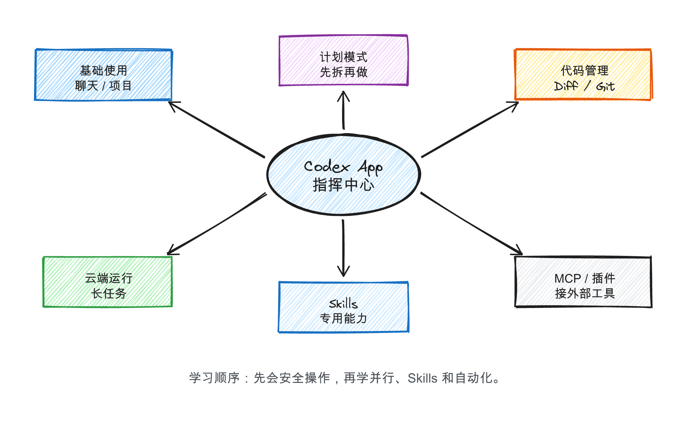
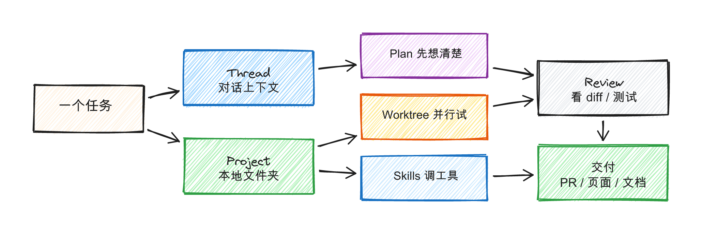

# Codex App：把 AI 编程从聊天窗口变成项目指挥台

> 课程来源：技术爬爬虾《Codex (APP) 保姆级全攻略，海量实战教程，一期精通 Codex》  
> B 站链接：https://www.bilibili.com/video/BV1Kk9kBAEJv/  
> 发布时间：2026-04-28，视频时长：38 分 13 秒  
> 本文是基于公开视频信息、OpenAI 官方资料和原创整理制作的图文学习稿，不复制视频逐字稿。


## 1. 一句话理解

Codex App 不只是“帮你写代码的聊天框”。更准确地说，它像一个项目指挥台：你把任务、项目文件夹和约束交给它，它用线程、项目、计划模式、Worktree、Skills、MCP 和自动化，把“想法”拆成可以审核、可以测试、可以交付的工作。

这门课适合作为学习平台里的“Codex App 主课”：它足够新，覆盖了从基础使用到 Skills、MCP、云端运行和自动化的完整路径；但图文稿里需要把课程经验和官方规则分开，尤其是账号额度、免费范围、速度和权限策略这类会变化的信息，都以 OpenAI 官方页面为准。

## 2. 这门课为什么值得转成图文

| 维度 | 判断 |
|---|---|
| 时效性 | 2026-04-28 发布，符合“2026 年以后课程”的筛选标准。 |
| 完整度 | 有引言、基础使用、画图、计划模式、代码管理、云端运行、记忆系统、插件自动化、Skills、MCP 等章节。 |
| 实操性 | 不是纯概念介绍，而是围绕 Codex App 的真实工作流展开。 |
| 平台适配 | 适合拆成短图文卡片、流程图、练习任务和提示词模板。 |


## 3. 先建立正确心智

学习 Codex App 的顺序不要反过来。不要先迷恋 MCP、插件和自动化，而是先把最基础的闭环跑通：

1. 让它读一个安全项目文件夹。
2. 让它先写计划，不急着改文件。
3. 你确认计划后，再让它动手。
4. 每次都看 diff 和运行结果。
5. 确认没问题，再提交或继续迭代。

OpenAI 官方资料也强调：Codex App 是面向多代理工作流的指挥中心，支持 Worktree、Skills 和后台任务；新手入门则建议从小任务开始，使用默认权限，逐步建立信任。

## 4. 能力地图



建议把 Codex App 拆成 6 个能力模块来学：

| 模块 | 学什么 | 先做到什么程度 |
|---|---|---|
| 基础使用 | Thread、Project、读文件夹 | 能让 Codex 解释项目结构 |
| 计划模式 | 先拆任务，再执行 | 复杂任务先要计划和验收标准 |
| 代码管理 | diff、测试、提交 | 每次都知道它改了什么 |
| Worktree | 并行方案、隔离修改 | 能同时试两个方案，不污染主线 |
| Skills | 把重复流程沉淀成能力 | 先做一个“生成课程卡片”的小 Skill |
| MCP/插件 | 连接外部工具 | 基础熟了以后再逐步接入 |

## 5. 标准工作流



### Step 1：建一个安全项目文件夹

不要一上来把整个电脑、公司仓库或重要项目交给 Codex。先建一个小文件夹，例如：

```text
Codex-Lab/
├── notes/
├── website-demo/
└── experiments/
```

适合第一天练习的任务有：整理课程卡片、生成一个静态网页、清理一份 CSV、把会议纪要变成待办清单。

### Step 2：创建 Thread，但先让它观察

第一条提示词可以这样写：

```text
请先检查这个项目文件夹，告诉我里面有什么。
然后提出一个你可以安全完成的小任务。
在我确认之前，不要修改任何文件。
```

这个提示词的价值是：让 Codex 先观察、再建议、最后等你批准。

### Step 3：复杂任务先开 Plan

当任务超过 3 步，就先让 Codex 写计划：

```text
我想做一个“课程链接整理页面”。
请先给出实现计划，包括页面结构、数据字段、需要创建的文件、验收标准。
暂时不要写代码。
```

好的计划至少要包含：要改哪些文件、每一步完成什么、如何验证结果、可能会有什么风险。

### Step 4：让它改，但你要看 diff

Codex 很适合做第一版，但不要跳过审核。看 diff 时重点看三件事：

1. 有没有改到不该改的文件。
2. 有没有引入你看不懂的外部依赖。
3. 有没有把 API key、私密路径、用户数据写进代码。

### Step 5：用 Skills 做重复任务

Skills 的本质是“把一套稳定流程写成可复用说明 + 资源 + 脚本”。适合做：

1. 自动整理课程资料。
2. 自动生成课程图文草稿。
3. 自动生成 Git commit 摘要。
4. 把网页截图和链接整理成报告。

第一次不要贪大，可以从“生成课程信息卡片”开始。

### Step 6：MCP 和插件放到第二阶段

MCP/插件能让 Codex 接外部工具，比如设计稿、项目管理、部署平台、文档系统。它很强，但也更容易变乱。

推荐顺序是：先会本地项目，再会 Plan 和 diff，再上 Skills，最后接 MCP、自动化和云端任务。

## 6. 跟做练习：做一个课程卡片网页

这是最适合我们学习平台的第一个 Codex App 练习。

目标：做一个单页网页，展示 6 门 AI 编程课程。

数据字段：

```json
{
  "title": "课程名",
  "creator": "UP主",
  "tool": "Codex / OpenClaw / Claude Code / Stitch",
  "level": "入门 / 进阶",
  "url": "B站链接",
  "why": "为什么值得学"
}
```

给 Codex 的提示词：

```text
请在当前文件夹里创建一个静态网页，用课程卡片展示这些 AI 编程课程。
要求：
1. 使用纯 HTML/CSS/JS，不要引入复杂框架。
2. 页面有筛选按钮：全部、Codex、OpenClaw、Claude Code、Stitch。
3. 每张卡片展示课程名、UP主、工具、难度、推荐理由和“打开课程”链接。
4. 先给出文件计划，等我确认后再写代码。
```

验收标准：

1. 双击 `index.html` 能打开。
2. 卡片不挤、不溢出。
3. 筛选按钮能工作。
4. 每个课程链接能跳转。

## 7. 常见误区

| 误区 | 更好的做法 |
|---|---|
| 一上来给“帮我做完整 App” | 先让它写计划和验收标准 |
| 直接给全盘权限 | 只给项目文件夹，默认权限起步 |
| 不看 diff 就提交 | 每次都看改了什么、能不能跑 |
| 插件、MCP、Skills 全装上 | 先学基础，再逐步加能力 |
| 把 Codex 当替代程序员 | 把它当执行力很强、但需要你审核的项目成员 |

## 8. 可拆成学习平台的 6 节课

| 课节 | 标题 | 产出物 |
|---|---|---|
| 01 | Codex App 是什么 | 一张能力地图 |
| 02 | 第一次连接项目 | 一个安全实验文件夹 |
| 03 | 用 Plan 模式拆任务 | 一份任务计划 |
| 04 | 用 diff 审核 AI 代码 | 一份修改检查清单 |
| 05 | 用 Codex 做课程卡片网页 | 一个静态网页 |
| 06 | Skills 和 MCP 入门 | 一个可复用的小 Skill |

## 9. 来源与校验

- B 站课程：技术爬爬虾《Codex (APP) 保姆级全攻略，海量实战教程，一期精通 Codex》  
  https://www.bilibili.com/video/BV1Kk9kBAEJv/
- OpenAI Codex 产品页：  
  https://openai.com/codex/
- OpenAI《Introducing the Codex app》：  
  https://openai.com/index/introducing-the-codex-app/
- OpenAI Academy《How to get started with Codex》：  
  https://openai.com/academy/codex-how-to-start/
